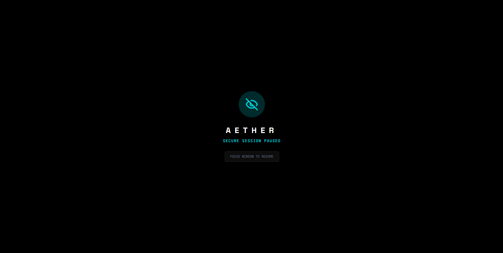

<div align="center">

# A E T H E R 
### Z E R O - T R U S T // M E S H // N O D E

[](https://github.com/saurav-z/aether-chat)
[](https://opensource.org/licenses/MIT)
[-blue.svg)](https://www.mongodb.com/)
[](https://github.com/saurav-z/aether-chat)


**The Sovereign Communication Terminal.**  
*No Logs. No Masters. No Trace. No Tracking. No Backend Storage.*

---

## 🔒 TRUE END-TO-END ENCRYPTION

All messages are encrypted on your device and can only be decrypted by the intended recipient. The backend never sees your private keys or message contents. No keys are ever shared over the network—only public keys are exchanged. Each message uses a unique symmetric key, and forward secrecy is enforced.

## 🛡️ PRIVACY-FIRST, STATELESS BACKEND

- The backend acts only as a relay for encrypted payloads and public keys.
- No user data, private keys, or decrypted messages are ever stored or logged.
- No analytics, tracking, or session logging.
- All encryption and decryption happens on the client.

## 🚀 SCALABLE, SECURE RELAY

- Supports Redis pub-sub for multi-instance scaling (set `REDIS_URL`).
- Strict rate limiting and per-socket/IP quotas prevent abuse.
- Shard acknowledgements are bound to the receiving socket/session for security.
- Topic IDs are validated to prevent resource exhaustion.

## ⚠️ PERMANENT DATA LOSS ON TOO MANY LOGIN FAILURES

After 15 incorrect password attempts, your chat vault is permanently deleted for your safety. There is no password reset or recovery.

[Visit Live Site](https://aether.ekg.com.np) · [Report Bug](https://github.com/saurav-z/aether-chat/issues)

</div>

---

## 📡 TRANSMISSION SPECS

Aether is not just a chat app; it is a **digital safehouse**. It assumes the network is compromised, the server is hostile, and your device is being watched.

*   **Encryption**: AES-256-GCM + ECDH (P-256) Curve.
*   **Protocol**: Rolling Hash Rendezvous (Anti-Traffic Analysis).
*   **Payload Cap**: **16MB** per transmission (Encrypted Shard Limit).
*   **Storage**: Volatile RAM (Default) or Mongo "Dead Drop".

---

## 🛡️ THE ARCHITECTURE



*For a detailed technical breakdown, see [ARCHITECTURE.md](docs/ARCHITECTURE.md)*


### 1. The Blind Relay (Server)
The server is a "dumb pipe". It sees only encrypted binary blobs. It does not know who you are, who you are talking to, or what you are saying. It stores messages in **RAM** by default, or can be scaled with Redis pub-sub for multi-instance deployments. If the server is seized or rebooted, all undelivered messages are incinerated instantly. No tracking, no logs, no analytics—ever.


### 2. The Dead Drop (Persistence)
Messages are temporary.
*   **Default TTL**: 24 Hours.
*   **Delivery Rule**: Once *the intended device* downloads a message, the server deletes it. Only the socket that received a shard can acknowledge/delete it.
*   **Sync**: Identity sync clones your vault, but new messages are delivered to the *first* active device only. This preserves Forward Secrecy.

### 3. Secure File Transfer & Limits
To maintain mesh integrity and browser performance during heavy encryption rounds, file transfers are strictly capped at **16MB** per chunk.
*   Files are encrypted client-side and uploaded/downloaded in chunks. The server only relays encrypted blobs, never plaintext.
*   Chunking allows large files to be sent even on free hosts with RAM/disk limits. Chunks are deleted after delivery or TTL expiry.
*   Images are stripped of EXIF/GPS metadata *client-side* before encryption.
*   Files larger than 16MB per chunk are rejected at the source.

---


## ⚠️ OPERATIONAL RISKS

*   **Loss of Key**: Your Master Password *is* your key. There is no "Forgot Password". Lose it, and your identity is lost forever.
*   **Permanent Deletion**: 15 failed login attempts will permanently delete your chat vault for your safety.
*   **Session Expiry**: You can set password/session expiry (e.g., 5 min, 1 hour, 1 day, 1 week). After expiry/inactivity, the vault is locked and keys are wiped from memory.
*   **Device Key Required**: Vault unlock requires both your password and a device-stored key. Device key can be securely transferred to another device via QR code or encrypted transfer. Without both, data is unrecoverable.
*   **Battery Drain**: Aether keeps a live WebSocket tunnel open and performs continuous crypto-operations. It consumes significantly more power than standard apps.
*   **Single Device**: Messages are deleted upon delivery. If you have Aether open on a Laptop and a Phone, only *one* will receive the message.

---

## 💾 DEPLOYMENT PROTOCOL

### Option A: Docker (Recommended)
Deploy your own sovereign node in seconds.

1.  **Clone**
    ```bash
    git clone https://github.com/saurav-z/aether-chat.git
    cd aether
    ```

2.  **Configure Environment** (Optional)
    ```bash
    cp backend/.env.example backend/.env
    cp frontend/.env.example frontend/.env
    # Edit .env files if needed (default values work for local dev)
    ```

3.  **Ignition**
    ```bash
    docker-compose up -d --build
    ```

4.  **Access**
    - Frontend: `http://localhost:5173`
    - Backend: `http://localhost:3000`
    - MongoDB: `localhost:27017`

### Option B: Manual (Dev)
Hack the Gibson.

1.  **Install Backend Deps**
    ```bash
    cd backend && npm install && cd ..
    ```

2.  **Install Frontend Deps**
    ```bash
    cd frontend && npm install && cd ..
    ```

3.  **Configure Environment**
    ```bash
    cp backend/.env.example backend/.env
    cp frontend/.env.example frontend/.env
    ```

4.  **Start Backend** (Terminal 1)
    ```bash
    cd backend && node server.js
    ```

5.  **Start Frontend** (Terminal 2)
    ```bash
    cd frontend && npm run dev
    ```

6.  **Access**
    - Frontend: `http://localhost:5173`
    - Backend API: `http://localhost:3000`

---

<div align="center">
  <p>Built with 💀 and ☕ by <a href="https://github.com/saurav-z">saurav-z</a></p>
</div>
